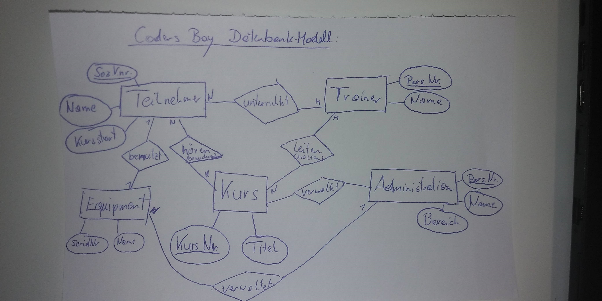
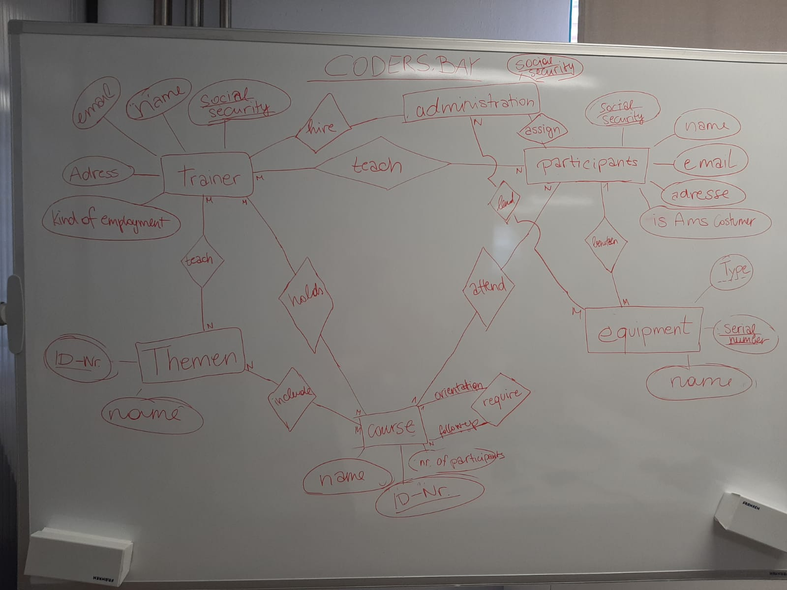
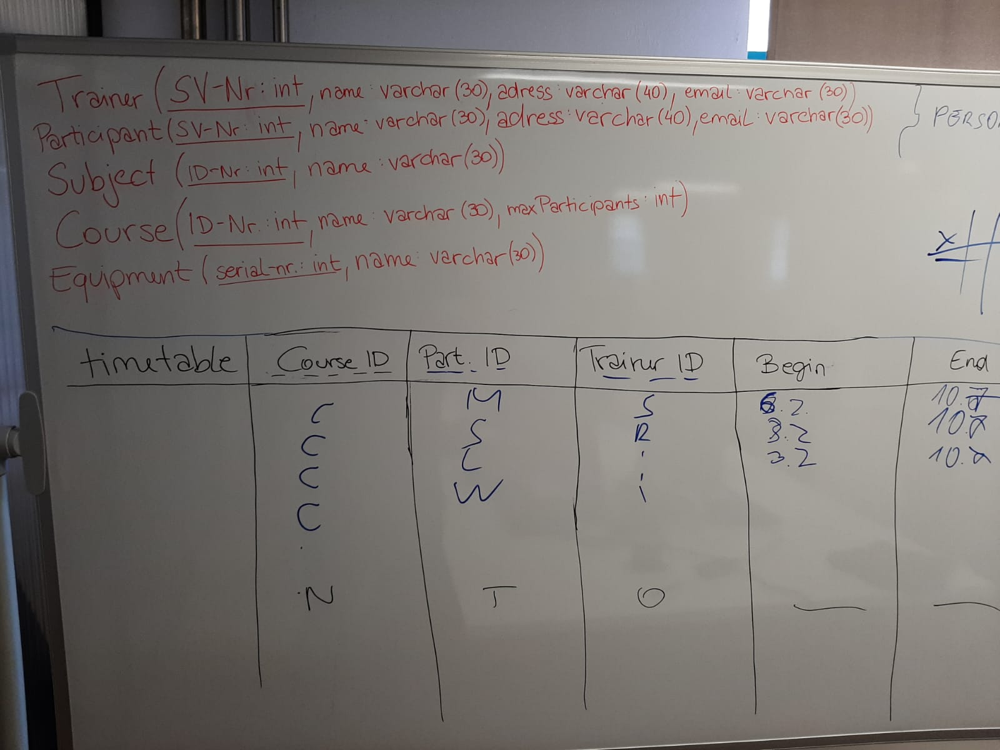

CodersBay ERM:

## first solution:

Group Solution:

## second solution:

### textual notation:

* participant ( **participantID**:INT, firstname:VARCHAR(32), lastname:VARCHAR(32), email:VARCHAR(32), 
 address:VARCHAR(32), city:VARCHAR(32), postalcode:INT, isamscustomer:BOOLEAN )
 
* trainer ( **trainerID**:INT, firstname:VARCHAR(32), lastname:VARCHAR(32), email:VARCHAR(32), 
           address:VARCHAR(32), city:VARCHAR(32), postalcode:INT )

* subject ( **subjectID**:INT, title:VARCHAR(32) )

* course ( **courseID**:INT, title:VARCHAR(32), maxnumberofparticipants:INT , courseleader:INT, roomNr:INT )

* employee ( **employeeID**, firstname:VARCHAR(32), lastname:VARCHAR(32), email:VARCHAR(32), 
                            address:VARCHAR(32), city:VARCHAR(32), postalcode:INT, role:VARCHAR(32))

* equipment ( **serialNR**:INT, name:VARCHAR(32), type:VARCHAR(32))                            

* equipmentmanagement ( *serialNR*:INT, *participantID*:INT, dateofreceive:DATE, dateofreturn:DATE)

* coursemanagement ( )